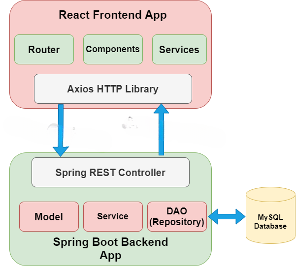
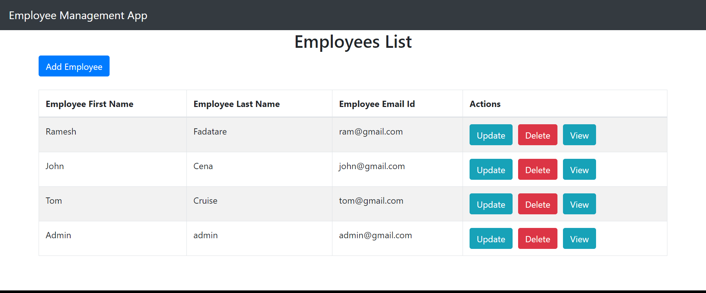

# Mitarbeitermanagement-Anwendung

In diesem Full-Stack-Projekt lernen wir, wie man eine einfache Full-Stack-Webanwendung entwickelt, die eine grundlegende Mitarbeitermanagement-Anwendung mit React und Spring Boot ist.
Der Backend-Server verwendet Spring Boot mit Spring Web MVC für REST-APIs und Spring Data JPA zur Interaktion mit der MySQL-Datenbank. Die Frontend-Seite besteht aus React, React Router, Axios und Bootstrap.

# Spring Boot React Full-Stack-Architektur

# Was werden wir bauen?
Wir werden eine Full-Stack-Webanwendung entwickeln, die eine grundlegende ***Mitarbeitermanagement-Anwendung*** mit CRUD-Funktionen ist:

- Mitarbeiter erstellen
- Mitarbeiter auflisten
- Mitarbeiter aktualisieren
- Mitarbeiter löschen
- Mitarbeiter anzeigen

Im Folgenden ist der Screenshot der endgültigen Version unserer Bewerbung: 

# Kurze Übersicht über React und Spring Boot

## Was ist React JS?

- React wird verwendet, um Benutzeroberflächen (UI) im Frontend zu erstellen. 
- React ist kein Framework (im Gegensatz zu Angular, das eher meinungsstark ist). 
- React ist ein Open-Source-Projekt, das von Facebook entwickelt wurde.

## Was ist ein Spring Boot?

- Spring boot, um REST-Webservices und Microservices zu entwickeln. 
- Spring Boot hat das Spring-Framework auf die nächste Stufe gehoben. Es hat die Konfigurations- und Aufbauzeit für Frühjahrsprojekte drastisch reduziert. 
- Du kannst ein Projekt mit fast null Konfiguration einrichten und anfangen, die Dinge zu bauen, die für deine Anwendung wirklich wichtig sind.

### Was sollte gemacht werden?

- Die FULL-STACK-Anwendung mit React und Spring Boot entwickeln 
- Die Grundlagen des Aufbaus großartiger Frontend-Anwendungen mit React 
- Die Einführung von Spring Boot in den Aufbau großartiger RESTful-APIs eingeführt 
- Der Aufbau einen REST-API-Aufruf von React in eine Spring Boot RESTful API
- Die Grundlagen von React – Komponenten – JSX, State und Props 
- Die entwicklung Schritt für Schritt eine Employee Management Full Stack Application mit CRUD-Funktionalitäten

# Voraussetzungen

- Grundlegende Vertrautheit mit HTML und CSS 
- Grundkenntnisse in JavaScript und Programmierung
- Spring Boot Grundlagen
- ReactJS-Grundlagen
- Node.js und npm weltweit installiert

# Full-Stack-App-Entwicklung

Wir werden zwei Projekte aufbauen:
1. sprint boot-backend (Server) – Zur Entwicklung der REST-API
2. react-frontend (client) – Consume REST API

## Serverseitige Werkzeuge und Technologien

- Spring Boot 2 +
- SpringData JPA (Hibernate)
- Maven 3.2 +
- JDK 1.8 +
- Eingebettetes Tomcat 8.5+
- MySQL Database

## Clientsseitige Werkzeuge und Technologien

- React
- Modern JavaScript (ES6)
- NodeJS und NPM
- VS Code IDE
- Create React App CLI
- Bootstrap 4.5 und Axios HTTP-Bibliothek 

# Lernplan: Mitarbeitermanagement Full-Stack-Anwendung

---

## PHASE 1 — HTML

| Nr | Titel | Link |
|---|---|---|
| 1 | What is HTML? | [Link](https://www.rameshfadatare.com/html-tutorial/what-is-html/) |
| 2 | Structure of HTML Document | [Link](https://www.rameshfadatare.com/html-tutorial/structure-of-html-document/) |
| 3 | HTML Elements | [Link](https://www.rameshfadatare.com/html-tutorial/html-elements/) |
| 4 | HTML Attributes | [Link](https://www.rameshfadatare.com/html-tutorial/html-attributes/) |
| 5 | HTML Headings | [Link](https://www.rameshfadatare.com/html-tutorial/html-headings/) |
| 6 | **HTML Tables** ⭐ | [Link](https://www.rameshfadatare.com/html-tutorial/html-tables/) |
| 7 | HTML Links | [Link](https://www.rameshfadatare.com/html-tutorial/html-links/) |
| 8 | HTML Div Element | [Link](https://www.rameshfadatare.com/html-tutorial/html-div-element/) |
| 9 | HTML Class Attribute | [Link](https://www.rameshfadatare.com/html-tutorial/html-class-attribute/) |
| 10 | HTML id Attribute | [Link](https://www.rameshfadatare.com/html-tutorial/html-id-attribute/) |
| 11 | **HTML Forms** ⭐ | [Link](https://www.rameshfadatare.com/html-tutorial/html-forms/) |
| 12 | HTML Form Elements | [Link](https://www.rameshfadatare.com/html-tutorial/html-form-elements/) |
| 13 | HTML Input Types | [Link](https://www.rameshfadatare.com/html-tutorial/html-input-types/) |
| 14 | HTML Validation | [Link](https://www.rameshfadatare.com/html-tutorial/html-validation/) |

---

## PHASE 1 — CSS

| Nr | Titel | Link |
|---|---|---|
| 1 | What is CSS? | [Link](https://www.rameshfadatare.com/css-tutorial/what-is-css/) |
| 2 | CSS Syntax | [Link](https://www.rameshfadatare.com/css-tutorial/css-syntax/) |
| 3 | CSS Selectors | [Link](https://www.rameshfadatare.com/css-tutorial/css-selectors/) |
| 4 | Adding CSS to HTML | [Link](https://www.rameshfadatare.com/css-tutorial/adding-css-to-html/) |
| 5 | CSS Colors | [Link](https://www.rameshfadatare.com/css-tutorial/css-colors/) |
| 6 | CSS Backgrounds | [Link](https://www.rameshfadatare.com/css-tutorial/css-backgrounds/) |
| 7 | CSS Borders | [Link](https://www.rameshfadatare.com/css-tutorial/css-borders/) |
| 8 | CSS Padding | [Link](https://www.rameshfadatare.com/css-tutorial/css-padding/) |
| 9 | CSS Height, Width, and Max-width | [Link](https://www.rameshfadatare.com/css-tutorial/css-height-width-and-max-width/) |
| 10 | **CSS Box Model** ⭐ | [Link](https://www.rameshfadatare.com/css-tutorial/css-box-model/) |
| 11 | CSS Text | [Link](https://www.rameshfadatare.com/css-tutorial/css-text/) |
| 12 | CSS Fonts | [Link](https://www.rameshfadatare.com/css-tutorial/css-fonts/) |
| 13 | **CSS Tables** ⭐ | [Link](https://www.rameshfadatare.com/css-tutorial/css-tables/) |
| 14 | CSS display Property | [Link](https://www.rameshfadatare.com/css-tutorial/css-display-property/) |
| 15 | CSS Align | [Link](https://www.rameshfadatare.com/css-tutorial/css-align/) |
| 16 | **CSS Forms** ⭐ | [Link](https://www.rameshfadatare.com/css-tutorial/css-forms/) |
| 17 | CSS Website Layout | [Link](https://www.rameshfadatare.com/css-tutorial/css-website-layout/) |

---

## PHASE 2 — JavaScript (ES6)

| Nr | Titel | Link |
|---|---|---|
| 1 | Introduction to JavaScript | [Link](https://www.rameshfadatare.com/javascript-tutorial/introduction-to-javascript/) |
| 2 | Setting Up the Development Environment | [Link](https://www.rameshfadatare.com/javascript-tutorial/setting-up-the-development-environment-for-javascript/) |
| 3 | JavaScript Variables | [Link](https://www.rameshfadatare.com/javascript-tutorial/javascript-variables/) |
| 4 | JavaScript let | [Link](https://www.rameshfadatare.com/javascript-tutorial/javascript-let/) |
| 5 | JavaScript const | [Link](https://www.rameshfadatare.com/javascript-tutorial/javascript-const/) |
| 6 | JavaScript Data Types | [Link](https://www.rameshfadatare.com/javascript-tutorial/javascript-data-types/) |
| 7 | JavaScript Operators | [Link](https://www.rameshfadatare.com/javascript-tutorial/javascript-operators/) |
| 8 | JavaScript Comparison Operators | [Link](https://www.rameshfadatare.com/javascript-tutorial/javascript-comparison-operators/) |
| 9 | JavaScript Logical Operators | [Link](https://www.rameshfadatare.com/javascript-tutorial/javascript-logical-operators/) |
| 10 | JavaScript if Statement | [Link](https://www.rameshfadatare.com/javascript-tutorial/javascript-if-statement/) |
| 11 | JavaScript Ternary Operator | [Link](https://www.rameshfadatare.com/javascript-tutorial/javascript-conditional-ternary-operator/) |
| 12 | JavaScript for Loop | [Link](https://www.rameshfadatare.com/javascript-tutorial/javascript-for-loop/) |
| 13 | JavaScript for...of Loop | [Link](https://www.rameshfadatare.com/javascript-tutorial/javascript-for-of-loop/) |
| 14 | JavaScript Functions | [Link](https://www.rameshfadatare.com/javascript-tutorial/javascript-functions/) |
| 15 | **JavaScript Arrow Functions** ⭐⭐ | [Link](https://www.rameshfadatare.com/javascript-tutorial/javascript-arrow-functions/) |
| 16 | JavaScript Higher-Order Functions | [Link](https://www.rameshfadatare.com/javascript-tutorial/javascript-higher-order-functions/) |
| 17 | JavaScript Objects | [Link](https://www.rameshfadatare.com/javascript-tutorial/javascript-objects/) |
| 18 | JavaScript Strings | [Link](https://www.rameshfadatare.com/javascript-tutorial/javascript-strings/) |
| 19 | **JavaScript Arrays** ⭐⭐ | [Link](https://www.rameshfadatare.com/javascript-tutorial/javascript-arrays/) |
| 20 | JavaScript Classes and Objects | [Link](https://www.rameshfadatare.com/javascript-tutorial/javascript-classes-and-objects/) |
| 21 | JavaScript this Keyword | [Link](https://www.rameshfadatare.com/javascript-tutorial/javascript-this-keyword/) |
| 22 | JavaScript try, catch, and finally | [Link](https://www.rameshfadatare.com/javascript-tutorial/javascript-try-catch-and-finally/) |

---

## PHASE 3 — Java Grundlagen

| Nr | Titel | Link |
|---|---|---|
| 1 | Overview of Java | [Link](https://www.rameshfadatare.com/java-programming/overview-of-java/) |
| 2 | Setting Up the Java Environment | [Link](https://www.rameshfadatare.com/java-programming/setting-up-the-java-environment/) |
| 3 | Writing Your First Java Program | [Link](https://www.rameshfadatare.com/java-programming/writing-your-first-java-program/) |
| 4 | Java Variables | [Link](https://www.rameshfadatare.com/java-programming/java-variables/) |
| 5 | Java Data Types | [Link](https://www.rameshfadatare.com/java-programming/java-data-types/) |
| 6 | Java Operators | [Link](https://www.rameshfadatare.com/java-programming/java-operators/) |
| 7 | Java Comments | [Link](https://www.rameshfadatare.com/java-programming/java-comments/) |
| 8 | Java if Statement | [Link](https://www.rameshfadatare.com/java-programming/java-if-statement/) |
| 9 | Java for Loop | [Link](https://www.rameshfadatare.com/java-programming/java-for-loop/) |
| 10 | Java for-each Loop | [Link](https://www.rameshfadatare.com/java-programming/java-for-each-loop/) |
| 11 | Introduction to Java OOP | [Link](https://www.rameshfadatare.com/java-programming/introduction-to-java-oop/) |
| 12 | **Java Classes and Objects** ⭐⭐ | [Link](https://www.rameshfadatare.com/java-programming/java-classes-and-objects/) |
| 13 | **Java Constructors** ⭐ | [Link](https://www.rameshfadatare.com/java-programming/java-constructors/) |
| 14 | Java Access Modifiers | [Link](https://www.rameshfadatare.com/java-programming/java-access-modifiers/) |
| 15 | **Java Encapsulation** ⭐ | [Link](https://www.rameshfadatare.com/java-programming/java-encapsulation/) |
| 16 | Java Inheritance | [Link](https://www.rameshfadatare.com/java-programming/java-inheritance/) |
| 17 | **Java Interface** ⭐ | [Link](https://www.rameshfadatare.com/java-programming/java-interface/) |
| 18 | **Java Packages** ⭐ | [Link](https://www.rameshfadatare.com/java-programming/java-packages/) |
| 19 | **Java Annotations** ⭐⭐ | [Link](https://www.rameshfadatare.com/java-programming/java-annotations/) |
| 20 | Java Exception Handling | [Link](https://www.rameshfadatare.com/java-programming/java-exception-handling/) |
| 21 | **Java Custom Exceptions** ⭐ | [Link](https://www.rameshfadatare.com/java-programming/java-custom-exceptions/) |
| 22 | Java List Interface | [Link](https://www.rameshfadatare.com/java-programming/java-list-interface/) |
| 23 | Java ArrayList | [Link](https://www.rameshfadatare.com/java-programming/java-arraylist/) |
| 24 | Java Map Interface | [Link](https://www.rameshfadatare.com/java-programming/java-map-interface/) |
| 25 | **Java Optional Class** ⭐ | [Link](https://www.rameshfadatare.com/java-programming/java-optional-class/) |

### Relevante Java APIs (Nachschlagewerk)

| API-Klasse | Wofuer im Projekt | Link |
|---|---|---|
| Java String Class | Employee-Felder (firstName, lastName, email) | [Link](https://www.rameshfadatare.com/java/java-string-tutorial/) |
| Java String Methods | String-Operationen | [Link](https://www.rameshfadatare.com/java-methods/java-string-methods/) |
| Java Object Class | Basisklasse aller Java-Objekte | [Link](https://www.rameshfadatare.com/java-lang/java-object-class/) |
| Java Object Class Methods | toString(), equals(), hashCode() | [Link](https://www.rameshfadatare.com/java-methods/java-object-class-methods/) |
| Java Integer Class | ID-Feld | [Link](https://www.rameshfadatare.com/java-lang/java-integer-class/) |
| Java Long Class | ID als Long-Typ | [Link](https://www.rameshfadatare.com/java-lang/java-long-class/) |
| Java Optional Class | findById() Rueckgabewert | [Link](https://www.rameshfadatare.com/java-util/java-optional-class-2/) |
| Java List Interface | findAll() Rueckgabewert | [Link](https://www.rameshfadatare.com/java-util/java-list-interface/) |
| Java ArrayList Class | List-Implementierung | [Link](https://www.rameshfadatare.com/java-util/java-arraylist-class/) |
| Java ArrayList Methods | add(), get(), remove(), size() | [Link](https://www.rameshfadatare.com/java-methods/java-arraylist-class-methods/) |
| Java HashMap Class | Map fuer Fehlermeldungen | [Link](https://www.rameshfadatare.com/java-util/java-hashmap-class/) |
| Java Exception Class | Basis fuer Custom Exceptions | [Link](https://www.rameshfadatare.com/java-lang/java-exception-class/) |
| Java RuntimeException Class | ResourceNotFoundException extends RuntimeException | [Link](https://www.rameshfadatare.com/java-lang/java-runtimeexception-class/) |
| Java NullPointerException | Haeufiger Fehler beim Debuggen | [Link](https://www.rameshfadatare.com/java-lang/java-nullpointerexception/) |
| Java @Override Annotation | Service-Methoden ueberschreiben | [Link](https://www.rameshfadatare.com/java-lang/java-override-annotation/) |

---

## PHASE 4 — MySQL

| Nr | Titel | Link |
|---|---|---|
| 1 | Introduction to MySQL | [Link](https://www.rameshfadatare.com/mysql-tutorial/introduction-to-mysql/) |
| 2 | Setting Up the MySQL Environment | [Link](https://www.rameshfadatare.com/mysql-tutorial/setting-up-the-mysql-environment/) |
| 3 | **MySQL CREATE Database** ⭐ | [Link](https://www.rameshfadatare.com/mysql-tutorial/mysql-create-database/) |
| 4 | **MySQL CREATE Table** ⭐ | [Link](https://www.rameshfadatare.com/mysql-tutorial/mysql-create-table/) |
| 5 | MySQL INSERT Query | [Link](https://www.rameshfadatare.com/mysql-tutorial/mysql-insert-query/) |
| 6 | MySQL SELECT Query | [Link](https://www.rameshfadatare.com/mysql-tutorial/mysql-select-query/) |
| 7 | MySQL UPDATE Query | [Link](https://www.rameshfadatare.com/mysql-tutorial/mysql-update-query/) |
| 8 | MySQL DELETE Query | [Link](https://www.rameshfadatare.com/mysql-tutorial/mysql-delete-query/) |
| 9 | MySQL WHERE Clause | [Link](https://www.rameshfadatare.com/mysql-tutorial/mysql-where-clause/) |
| 10 | **MySQL Primary Key** ⭐ | [Link](https://www.rameshfadatare.com/mysql-tutorial/mysql-primary-key/) |
| 11 | MySQL Data Types | [Link](https://www.rameshfadatare.com/mysql-tutorial/mysql-data-types/) |
| 12 | MySQL VARCHAR | [Link](https://www.rameshfadatare.com/mysql-tutorial/mysql-varchar/) |
| 13 | MySQL INT Data Type | [Link](https://www.rameshfadatare.com/mysql-tutorial/mysql-int-data-type/) |
| 14 | **MySQL AUTO_INCREMENT** ⭐ | [Link](https://www.rameshfadatare.com/mysql-tutorial/mysql-auto_increment/) |

---

## PHASE 5 — Spring Boot (Backend)

### Fundamentals

| Nr | Titel | Link |
|---|---|---|
| 1 | What is Spring Boot | [Link](https://www.rameshfadatare.com/spring-boot-tutorial/what-is-spring-boot/) |
| 2 | Why Spring Boot | [Link](https://www.rameshfadatare.com/spring-boot-tutorial/why-spring-boot/) |
| 3 | Spring vs Spring Boot | [Link](https://www.rameshfadatare.com/spring-boot-tutorial/spring-vs-spring-boot/) |
| 4 | Setting Up the Environment | [Link](https://www.rameshfadatare.com/spring-boot-tutorial/setting-up-the-environment-for-spring-boot/) |
| 5 | **First Spring Boot App (Spring Initializr)** ⭐⭐ | [Link](https://www.rameshfadatare.com/spring-boot-tutorial/create-and-setup-your-first-spring-boot-app-in-intellij-idea/) |
| 6 | Spring Boot Auto-Configuration | [Link](https://www.rameshfadatare.com/spring-boot-tutorial/spring-boot-auto-configuration/) |
| 7 | Spring Boot Starters | [Link](https://www.rameshfadatare.com/spring-boot-tutorial/spring-boot-starters/) |
| 8 | @SpringBootApplication Annotation | [Link](https://www.rameshfadatare.com/spring-boot-tutorial/spring-boot-springbootapplication-annotation/) |
| 9 | Spring Boot DevTools | [Link](https://www.rameshfadatare.com/spring-boot-tutorial/spring-boot-devtools/) |

### REST API Development ⭐⭐

| Nr | Titel | Link |
|---|---|---|
| 10 | **Build Your First REST API** ⭐⭐ | [Link](https://www.rameshfadatare.com/spring-boot-tutorial/build-your-first-spring-boot-rest-api/) |
| 11 | **REST API Returns Java Bean (JSON)** ⭐ | [Link](https://www.rameshfadatare.com/spring-boot-tutorial/spring-boot-rest-api-returns-java-bean-json/) |
| 12 | **REST API Returns List (JSON)** ⭐ | [Link](https://www.rameshfadatare.com/spring-boot-tutorial/spring-boot-rest-api-returns-list-of-java-beans-json/) |
| 13 | **@PathVariable** ⭐ | [Link](https://www.rameshfadatare.com/spring-boot-tutorial/spring-boot-rest-api-with-path-variable-pathvariable/) |
| 14 | **@GetMapping** ⭐ | [Link](https://www.rameshfadatare.com/spring-boot-tutorial/spring-boot-get-rest-api-getmapping-annotation/) |
| 15 | **@PostMapping und @RequestBody** ⭐ | [Link](https://www.rameshfadatare.com/spring-boot-tutorial/spring-boot-post-rest-api-postmapping-and-requestbody/) |
| 16 | **@PutMapping** ⭐ | [Link](https://www.rameshfadatare.com/spring-boot-tutorial/spring-boot-put-rest-api-putmapping-annotation/) |
| 17 | **@DeleteMapping** ⭐ | [Link](https://www.rameshfadatare.com/spring-boot-tutorial/spring-boot-delete-rest-api-deletemapping-annotation/) |

### Spring Data JPA + MySQL ⭐⭐

| Nr | Titel | Link |
|---|---|---|
| 18 | **Introduction to Spring Data JPA** ⭐⭐ | [Link](https://www.rameshfadatare.com/spring-boot-tutorial/introduction-to-spring-data-jpa/) |
| 19 | **Project Package Structure** ⭐ | [Link](https://www.rameshfadatare.com/spring-boot-tutorial/spring-boot-project-package-structure/) |
| 20 | **MySQL CRUD Setup** ⭐⭐ | [Link](https://www.rameshfadatare.com/spring-boot-tutorial/spring-boot-mysql-crud-operations-setup-the-spring-boot-project/) |
| 21 | **Build Save Student REST API** ⭐ | [Link](https://www.rameshfadatare.com/spring-boot-tutorial/build-save-student-rest-api/) |
| 22 | **Build Get Single Student REST API** ⭐ | [Link](https://www.rameshfadatare.com/spring-boot-tutorial/build-get-single-student-rest-api/) |
| 23 | **Build Get All Students REST API** ⭐ | [Link](https://www.rameshfadatare.com/spring-boot-tutorial/build-get-all-students-rest-api/) |
| 24 | **Build Update Student REST API** ⭐ | [Link](https://www.rameshfadatare.com/spring-boot-tutorial/build-update-student-rest-api/) |
| 25 | **Build Delete Student REST API** ⭐ | [Link](https://www.rameshfadatare.com/spring-boot-tutorial/build-delete-student-rest-api/) |
| 26 | **Spring Boot Exception Handling** ⭐ | [Link](https://www.rameshfadatare.com/spring-boot-tutorial/spring-boot-exception-handling/) |

### Zusaetzlich von JavaGuides

| Titel | Link |
|---|---|
| **Spring Data JPA Tutorial** | [Link](https://www.javaguides.net/p/spring-data-jpa-tutorial.html) |
| **REST API Tutorial** | [Link](https://www.javaguides.net/p/rest-api-tutorial.html) |

---

## PHASE 6 — React (Frontend)

### Grundlagen

| Nr | Titel | Link |
|---|---|---|
| 1 | What is React JS? | [Link](https://www.rameshfadatare.com/react-tutorial/what-is-react-js/) |
| 2 | Getting Started with React | [Link](https://www.rameshfadatare.com/react-tutorial/getting-started-with-react/) |
| 3 | **Creating a React Hello World App** ⭐ | [Link](https://www.rameshfadatare.com/react-tutorial/creating-a-react-hello-world-app/) |
| 4 | **React Project Structure and Flow** ⭐ | [Link](https://www.rameshfadatare.com/react-tutorial/react-project-structure-and-flow/) |
| 5 | **React Components** ⭐⭐ | [Link](https://www.rameshfadatare.com/react-tutorial/react-components/) |
| 6 | **React Functional Components** ⭐⭐ | [Link](https://www.rameshfadatare.com/react-tutorial/react-functional-components/) |
| 7 | **React JSX** ⭐ | [Link](https://www.rameshfadatare.com/react-tutorial/react-jsx/) |
| 8 | **React Props** ⭐ | [Link](https://www.rameshfadatare.com/react-tutorial/react-props/) |
| 9 | **React State** ⭐ | [Link](https://www.rameshfadatare.com/react-tutorial/react-state/) |
| 10 | React Destructuring Props and State | [Link](https://www.rameshfadatare.com/react-tutorial/react-destructuring-props-and-state/) |
| 11 | **React Event Handling** ⭐ | [Link](https://www.rameshfadatare.com/react-tutorial/react-event-handling/) |
| 12 | React Conditional Rendering | [Link](https://www.rameshfadatare.com/react-tutorial/react-conditional-rendering/) |
| 13 | **React List Rendering** ⭐ | [Link](https://www.rameshfadatare.com/react-tutorial/react-list-rendering/) |
| 14 | React CSS Styling | [Link](https://www.rameshfadatare.com/react-tutorial/react-css-styling/) |
| 15 | **React Forms** ⭐⭐ | [Link](https://www.rameshfadatare.com/react-tutorial/react-forms/) |
| 16 | **React Forms (Functional Components)** ⭐⭐ | [Link](https://www.rameshfadatare.com/react-tutorial/react-forms-using-functional-components/) |
| 17 | **React Form Validation** ⭐ | [Link](https://www.rameshfadatare.com/react-tutorial/react-form-validation/) |
| 18 | **React Router** ⭐⭐ | [Link](https://www.rameshfadatare.com/react-tutorial/react-router/) |
| 19 | **Using Bootstrap in a React App** ⭐⭐ | [Link](https://www.rameshfadatare.com/react-tutorial/using-bootstrap-in-a-react-app/) |

### React Hooks ⭐⭐

| Nr | Titel | Link |
|---|---|---|
| 20 | React Hooks | [Link](https://www.rameshfadatare.com/react-tutorial/react-hooks/) |
| 21 | **React useState Hook** ⭐⭐ | [Link](https://www.rameshfadatare.com/react-tutorial/react-usestate-hook/) |
| 22 | **React useEffect Hook** ⭐⭐ | [Link](https://www.rameshfadatare.com/react-tutorial/react-useeffect-hook/) |
| 23 | React useContext Hook | [Link](https://www.rameshfadatare.com/react-tutorial/react-usecontext-hook/) |
| 24 | React useRef Hook | [Link](https://www.rameshfadatare.com/react-tutorial/react-useref-hook/) |

