# Software-Architektur: Mitarbeitermanagement-Anwendung

---

## Inhaltsverzeichnis

1. [Gesamtübersicht](#1-gesamtübersicht)
2. [Schicht 1 — Datenbank (MySQL)](#2-schicht-1--datenbank-mysql)
3. [Schicht 2 — Backend (Spring Boot)](#3-schicht-2--backend-spring-boot)
4. [Schicht 3 — Frontend (React + Vite)](#4-schicht-3--frontend-react--vite)
5. [Datenfluss — Request-Lebenszyklus](#5-datenfluss--request-lebenszyklus)
6. [REST-API-Übersicht](#6-rest-api-übersicht)
7. [UML-Diagramme — Anleitung](#7-uml-diagramme--anleitung)
8. [Docker und Deployment](#8-docker-und-deployment)

---

## 1. Gesamtübersicht

Die Anwendung folgt der klassischen **3-Schichten-Architektur** (Three-Tier Architecture):

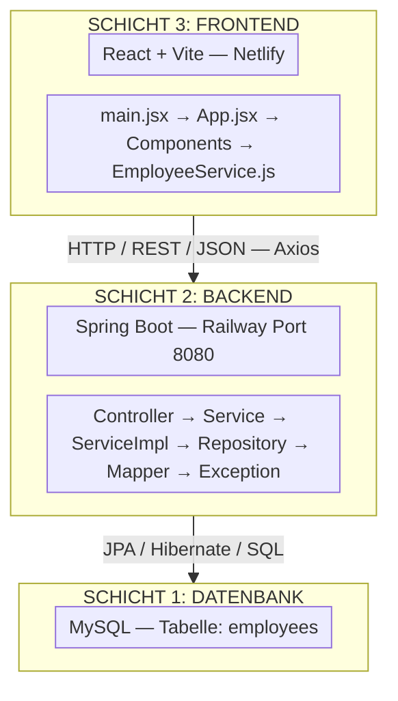

---

## 2. Schicht 1 — Datenbank (MySQL)

### Tabelle: `employees`

| Spaltenname  | SQL-Typ   | Constraint                      | Beschreibung                              |
| ------------ | --------- | ------------------------------- | ----------------------------------------- |
| `id`         | `BIGINT`  | `PRIMARY KEY`, `AUTO_INCREMENT` | Eindeutiger Bezeichner eines Mitarbeiters |
| `first_name` | `VARCHAR` | —                               | Vorname des Mitarbeiters                  |
| `last_name`  | `VARCHAR` | —                               | Nachname des Mitarbeiters                 |
| `email_id`   | `VARCHAR` | `NOT NULL`, `UNIQUE`            | E-Mail-Adresse (muss eindeutig sein)      |

**Ziel:** Speichert dauerhaft alle Mitarbeiterdaten. Die einzige Tabelle in der Anwendung. Kein Join, keine Fremdschlüssel.

**Abhängigkeiten:** Keine. Die Datenbank ist das unterste Glied der Kette und kennt keine anderen Schichten.

---

## 3. Schicht 2 — Backend (Spring Boot)

### Paketstruktur

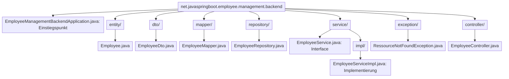

### Abhängigkeitsfluss im Backend

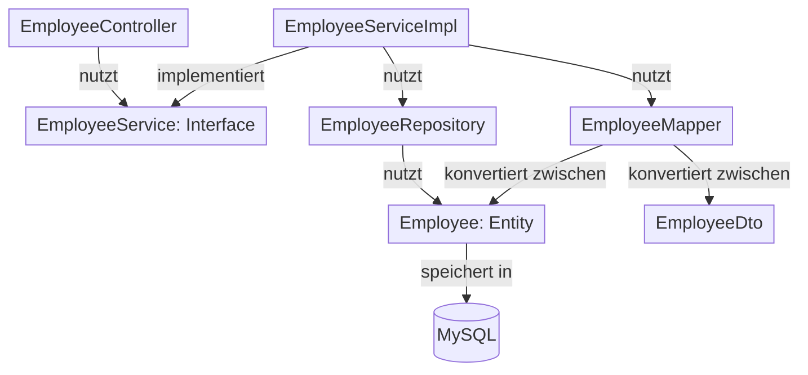

### 3.1 `EmployeeManagementBackendApplication.java`

| Eigenschaft    | Wert                     |
| -------------- | ------------------------ |
| **Paket**      | `backend`                |
| **Annotation** | `@SpringBootApplication` |
| **Typ**        | Klasse                   |

**Ziel:** Startet die gesamte Spring-Boot-Anwendung. Enthält die `main()`-Methode — der einzige Einstiegspunkt.

**Abhängigkeiten:** Keine direkten. Spring Boot initialisiert automatisch alle anderen Komponenten.

---

### 3.2 `Employee.java` — Paket `entity`

| Eigenschaft    | Wert                                                              |
| -------------- | ----------------------------------------------------------------- |
| **Annotation** | `@Entity`, `@Table(name = "employees")`                           |
| **Typ**        | Klasse (JPA-Entität)                                              |
| **Lombok**     | `@Getter`, `@Setter`, `@NoArgsConstructor`, `@AllArgsConstructor` |

**Felder:**

| Feld        | Typ      | Annotation                                                    |
| ----------- | -------- | ------------------------------------------------------------- |
| `id`        | `Long`   | `@Id`, `@GeneratedValue(IDENTITY)`                            |
| `firstName` | `String` | `@Column(name = "first_name")`                                |
| `lastName`  | `String` | `@Column(name = "last_name")`                                 |
| `email`     | `String` | `@Column(name = "email_id", nullable = false, unique = true)` |

**Ziel** Spiegelt die Datenbanktabelle `employees` als Java-Objekt. JPA/Hibernate liest und schreibt Datenbankzeilen automatisch als `Employee`-Objekte.

**Abhängigkeiten:**

- Jakarta Persistence API (JPA-Annotationen)
- Lombok (generiert Getter/Setter/Konstruktoren zur Compile-Zeit)

---

### 3.3 `EmployeeDto.java` — Paket `dto`

| Eigenschaft | Wert                                                              |
| ----------- | ----------------------------------------------------------------- |
| **Typ**     | Klasse (Data Transfer Object)                                     |
| **Lombok**  | `@Getter`, `@Setter`, `@NoArgsConstructor`, `@AllArgsConstructor` |

**Felder:** `id: Long`, `firstName: String`, `lastName: String`, `email: String`

**Ziel:** Ein sauberes Transportobjekt für die Kommunikation zwischen Backend und Frontend (JSON). Entkoppelt die interne Datenbankstruktur (`Employee`) von der öffentlichen API. Das Frontend sieht niemals die `@Column`- oder `@Table`-Annotationen der Entity.

**Abhängigkeiten:** Lombok — sonst keine.

---

### 3.4 `EmployeeMapper.java` — Paket `mapper`

| Eigenschaft  | Wert                    |
| ------------ | ----------------------- |
| **Typ**      | Klasse (Utility/Helper) |
| **Methoden** | 2 statische Methoden    |

**Methoden:**

| Methode                                  | Eingabe       | Ausgabe       |
| ---------------------------------------- | ------------- | ------------- |
| `mapToEmployeeDto(Employee employee)`    | `Employee`    | `EmployeeDto` |
| `mapToEmployee(EmployeeDto employeeDto)` | `EmployeeDto` | `Employee`    |

**Ziel:** Wandelt `Employee` ↔ `EmployeeDto` um. Kapselt die Konvertierungslogik an einer einzigen Stelle. Da alle Methoden `static` sind, wird kein Objekt instanziiert.

**Abhängigkeiten:**

- `Employee` (entity-Paket)
- `EmployeeDto` (dto-Paket)

---

### 3.5 `EmployeeRepository.java` — Paket `repository`

| Eigenschaft  | Wert                            |
| ------------ | ------------------------------- |
| **Typ**      | Interface                       |
| **Erbt von** | `JpaRepository<Employee, Long>` |

**Ziel:** Datenbankzugang ohne eigenen Code. Durch das Erben von `JpaRepository` stellt Spring Data JPA automatisch alle CRUD-Operationen bereit:

| Methode (geerbt) | SQL-Äquivalent                         |
| ---------------- | -------------------------------------- |
| `save(entity)`   | `INSERT` oder `UPDATE`                 |
| `findById(id)`   | `SELECT * FROM employees WHERE id = ?` |
| `findAll()`      | `SELECT * FROM employees`              |
| `delete(entity)` | `DELETE FROM employees WHERE id = ?`   |

**Abhängigkeiten:**

- `Employee` (entity-Paket)
- Spring Data JPA

---

### 3.6 `EmployeeService.java` — Paket `service`

| Eigenschaft | Wert      |
| ----------- | --------- |
| **Typ**     | Interface |

**Methoden (Vertrag):**

| Methode                                            | Rückgabe            |
| -------------------------------------------------- | ------------------- |
| `createEmployee(EmployeeDto employeeDto)`          | `EmployeeDto`       |
| `getEmployeeById(Long employeeId)`                 | `EmployeeDto`       |
| `getAllEmployees()`                                | `List<EmployeeDto>` |
| `updateEmployee(Long employeeId, EmployeeDto dto)` | `EmployeeDto`       |
| `deleteEmployee(Long employeeId)`                  | `void`              |

**Ziel:** Definiert den **Vertrag** der Geschäftslogik. Der Controller kennt nur dieses Interface — nicht die konkrete Implementierung. Das ist das **Prinzip der Abhängigkeitsumkehr (Dependency Inversion)**.

**Abhängigkeiten:** `EmployeeDto` (dto-Paket)

---

### 3.7 `EmployeeServiceImpl.java` — Paket `service.impl`

| Eigenschaft       | Wert                                          |
| ----------------- | --------------------------------------------- |
| **Annotation**    | `@Service`                                    |
| **Typ**           | Klasse                                        |
| **Implementiert** | `EmployeeService`                             |
| **Lombok**        | `@AllArgsConstructor` (Constructor Injection) |

**Ziel:** Die konkrete Umsetzung der Geschäftslogik. Für jede Operation:

| Operation   | Ablauf                                                                |
| ----------- | --------------------------------------------------------------------- |
| **Create**  | DTO → Entity (Mapper) → `save()` (Repository) → Entity → DTO (Mapper) |
| **GetById** | `findById()` → Exception wenn nicht gefunden → Entity → DTO           |
| **GetAll**  | `findAll()` → Stream → jede Entity → DTO → Liste zurückgeben          |
| **Update**  | `findById()` → Felder überschreiben → `save()` → Entity → DTO         |
| **Delete**  | `findById()` → Exception wenn nicht gefunden → `delete()`             |

**Abhängigkeiten:**

- Implementiert `EmployeeService` (service-Paket)
- `EmployeeRepository` (repository-Paket) — per Constructor Injection
- `EmployeeMapper` (mapper-Paket)
- `RessourceNotFoundException` (exception-Paket)

---

### 3.8 `RessourceNotFoundException.java` — Paket `exception`

| Eigenschaft    | Wert                                    |
| -------------- | --------------------------------------- |
| **Annotation** | `@ResponseStatus(HttpStatus.NOT_FOUND)` |
| **Typ**        | Klasse                                  |
| **Erbt von**   | `RuntimeException`                      |

**Ziel:** Eine benutzerdefinierte Exception. Wird geworfen, wenn ein Mitarbeiter per ID nicht in der Datenbank gefunden wird. Spring erkennt `@ResponseStatus(NOT_FOUND)` und sendet automatisch **HTTP 404** an den Client — kein manueller `try/catch` nötig.

**Abhängigkeiten:** `RuntimeException` (Java Standard), Spring Web (`HttpStatus`)

---

### 3.9 `EmployeeController.java` — Paket `controller`

| Eigenschaft    | Wert                                                                        |
| -------------- | --------------------------------------------------------------------------- |
| **Annotation** | `@RestController`, `@RequestMapping("/api/employees")`, `@CrossOrigin("*")` |
| **Typ**        | Klasse (REST-Controller)                                                    |
| **Lombok**     | `@AllArgsConstructor` (Constructor Injection)                               |

**Ziel:** Das Eingangstor des Backends. Empfängt HTTP-Anfragen vom Frontend, delegiert die Arbeit an `EmployeeService` und sendet die Antwort zurück. `@CrossOrigin("*")` erlaubt Anfragen vom React-Frontend (CORS).

**Endpunkte:**

| HTTP-Methode | Pfad                  | Controller-Methode        | HTTP-Antwort  |
| ------------ | --------------------- | ------------------------- | ------------- |
| `POST`       | `/api/employees`      | `createEmployee(dto)`     | `201 Created` |
| `GET`        | `/api/employees`      | `getAllEmployees()`       | `200 OK`      |
| `GET`        | `/api/employees/{id}` | `getEmployeeById(id)`     | `200 OK`      |
| `PUT`        | `/api/employees/{id}` | `updateEmployee(id, dto)` | `200 OK`      |
| `DELETE`     | `/api/employees/{id}` | `deleteEmployee(id)`      | `200 OK`      |

**Abhängigkeiten:**

- `EmployeeService` Interface (service-Paket) — per Constructor Injection
- `EmployeeDto` (dto-Paket)
- Spring Web (`@RestController`, `ResponseEntity`, `HttpStatus`)

---

## 4. Schicht 3 — Frontend (React + Vite)

### Dateistruktur

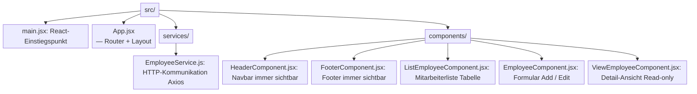

### Routing-Übersicht

| URL                  | Komponente              | Aktion                       |
| -------------------- | ----------------------- | ---------------------------- |
| `/`                  | `ListEmployeeComponent` | Alle Mitarbeiter anzeigen    |
| `/employees`         | `ListEmployeeComponent` | Alle Mitarbeiter anzeigen    |
| `/add-employee`      | `EmployeeComponent`     | Neuen Mitarbeiter erstellen  |
| `/edit-employee/:id` | `EmployeeComponent`     | Mitarbeiter bearbeiten       |
| `/view-employee/:id` | `ViewEmployeeComponent` | Mitarbeiter-Details anzeigen |

---

### 4.1 `main.jsx`

**Ziel:** Einstiegspunkt der React-Anwendung. Mountet `<App />` in den `<div id="root">` des HTML-Dokuments.

**Abhängigkeiten:** `App.jsx`, React, ReactDOM

---

### 4.2 `App.jsx`

**Ziel:** Definiert die Anwendungsstruktur mit `BrowserRouter`. Enthält `<HeaderComponent>` und `<FooterComponent>` als feste Rahmenelemente sowie alle `<Route>`-Definitionen. Entscheidet, welche Komponente bei welcher URL gerendert wird.

**Abhängigkeiten:** Alle 5 Komponenten, `react-router-dom` (`BrowserRouter`, `Routes`, `Route`)

---

### 4.3 `EmployeeService.js` — Ordner `services`

**Ziel:** Die **einzige Datei** im Frontend, die mit dem Backend kommuniziert. Kapselt alle HTTP-Aufrufe mit Axios an einer zentralen Stelle. Alle Komponenten rufen nur diese Funktionen auf — keine Komponente baut selbst HTTP-Requests.

**Basis-URL:** `https://springboot-production-77d6.up.railway.app/api/employees`

**Funktionen:**

| Funktion                       | HTTP     | URL                   | Zweck                       |
| ------------------------------ | -------- | --------------------- | --------------------------- |
| `listEmployees()`              | `GET`    | `/api/employees`      | Alle Mitarbeiter laden      |
| `createEmployee(employee)`     | `POST`   | `/api/employees`      | Neuen Mitarbeiter erstellen |
| `getEmployee(employeeId)`      | `GET`    | `/api/employees/{id}` | Einen Mitarbeiter laden     |
| `updateEmployee(employee, id)` | `PUT`    | `/api/employees/{id}` | Mitarbeiter aktualisieren   |
| `deleteEmployee(employeeId)`   | `DELETE` | `/api/employees/{id}` | Mitarbeiter löschen         |

**Abhängigkeiten:** Axios, Backend-URL (Railway)

---

### 4.4 `HeaderComponent.jsx`

**Ziel:** Zeigt die Navigationsleiste (Navbar) oben auf jeder Seite. Statisches UI-Element — kein State, keine API-Aufrufe.

**Abhängigkeiten:** Bootstrap CSS

---

### 4.5 `FooterComponent.jsx`

**Ziel:** Zeigt den Footer unten auf jeder Seite. Statisches UI-Element.

**Abhängigkeiten:** Bootstrap CSS

---

### 4.6 `ListEmployeeComponent.jsx`

**Ziel:** Die Hauptseite der Anwendung. Zeigt alle Mitarbeiter in einer Bootstrap-Tabelle. Beim ersten Rendern (`useEffect`) werden automatisch alle Mitarbeiter vom Backend geladen.

**State:**

| State-Variable | Typ     | Beschreibung                      |
| -------------- | ------- | --------------------------------- |
| `employees`    | `Array` | Liste aller geladenen Mitarbeiter |

**Funktionen:**

| Funktion             | Aktion                                                      |
| -------------------- | ----------------------------------------------------------- |
| `getAllEmployees()`  | Ruft `listEmployees()` auf → speichert Daten im State       |
| `addNewEmployee()`   | Navigiert zu `/add-employee`                                |
| `updateEmployee(id)` | Navigiert zu `/edit-employee/{id}`                          |
| `removeEmployee(id)` | Bestätigungsdialog → `deleteEmployee(id)` → Liste neu laden |

**Abhängigkeiten:** `EmployeeService.js` (`listEmployees`, `deleteEmployee`), `react-router-dom` (`useNavigate`)

---

### 4.7 `EmployeeComponent.jsx`

**Ziel:** Doppelfunktionales Formular — je nach URL entweder **Erstellen** (`/add-employee`) oder **Bearbeiten** (`/edit-employee/:id`). Enthält Formularvalidierung: alle 3 Felder sind Pflichtfelder.

**State:**

| State-Variable | Typ      | Beschreibung                                            |
| -------------- | -------- | ------------------------------------------------------- |
| `firstName`    | `String` | Wert des Vorname-Feldes                                 |
| `lastName`     | `String` | Wert des Nachname-Feldes                                |
| `email`        | `String` | Wert des E-Mail-Feldes                                  |
| `errors`       | `Object` | Fehlermeldungen pro Feld `{firstName, lastName, email}` |

**Logik:**

| Bedingung          | Aktion                                                               |
| ------------------ | -------------------------------------------------------------------- |
| URL hat keine `id` | Modus: **Add** — ruft `createEmployee()` auf                         |
| URL hat eine `id`  | Modus: **Edit** — lädt vorhandene Daten, ruft `updateEmployee()` auf |
| Formular ungültig  | Zeigt Fehlermeldungen — kein API-Aufruf                              |

**Abhängigkeiten:** `EmployeeService.js` (`createEmployee`, `getEmployee`, `updateEmployee`), `react-router-dom` (`useNavigate`, `useParams`)

---

### 4.8 `ViewEmployeeComponent.jsx`

**Ziel:** Read-only-Detailseite für einen einzelnen Mitarbeiter. Lädt beim Rendern den Mitarbeiter anhand der `id` aus der URL und zeigt seine Daten als statischen Text — kein Formular, keine Bearbeitungsmöglichkeit.

**State:** `firstName`, `lastName`, `email` (alle `String`)

**Abhängigkeiten:** `EmployeeService.js` (`getEmployee`), `react-router-dom` (`useNavigate`, `useParams`)

---

## 5. Datenfluss — Request-Lebenszyklus

### 5.1 Sequenz-Diagramm

**Zweck:** Den zeitlichen Ablauf eines konkreten Anwendungsfalls zeigen.

**Regeln:**

- Jeder Akteur = vertikale gestrichelte Linie (Lifeline) mit Rechteck oben
- Aufruf = ausgefüllter Pfeil `──►` mit Methodenname
- Antwort = gestrichelter Pfeil `---►` mit Rückgabewert
- Zeit fließt von **oben nach unten**

### Beispiel A: Mitarbeiter erstellen (`POST`)

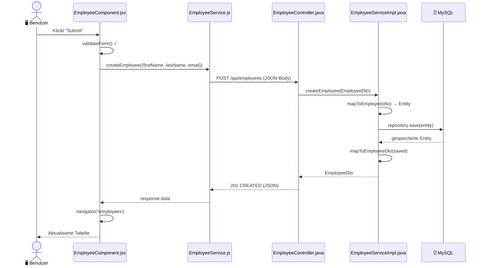

---

### Beispiel B: Mitarbeiter aktualisieren (`PUT`)

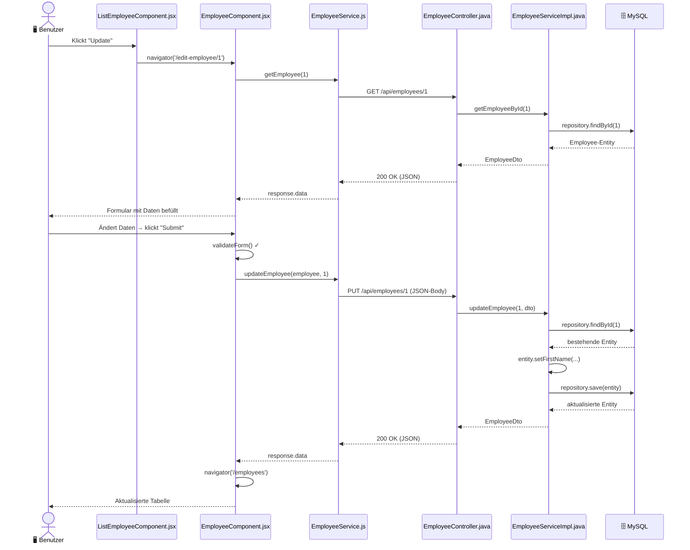

---

### Beispiel C: Mitarbeiter anzeigen - VIEW (`GET`)

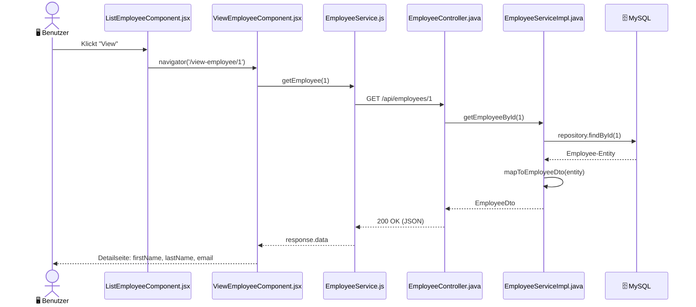

---

### Beispiel D: Alle Mitarbeiter laden - ALLE (`GET`)

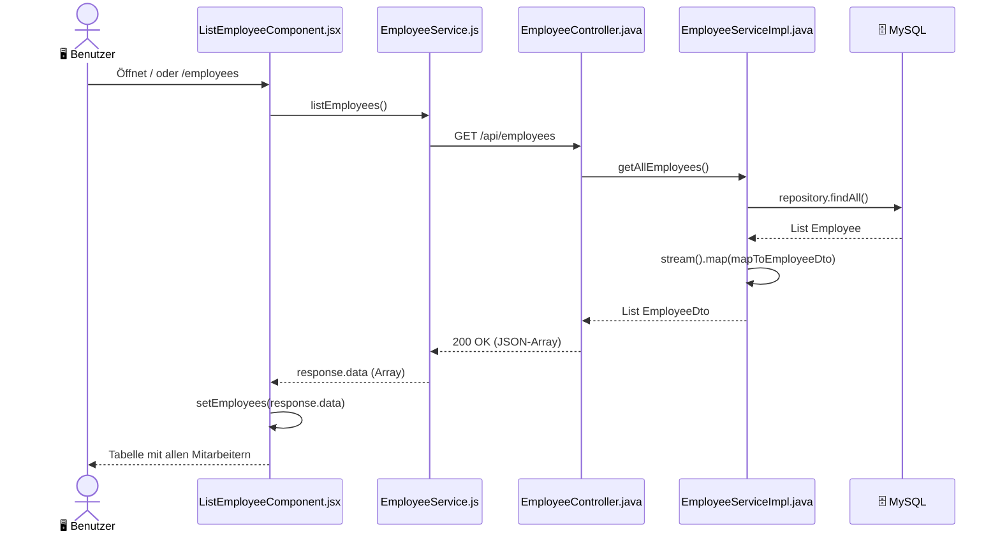

### Beispiel D: Mitarbeiter löschen (`DELETE`)

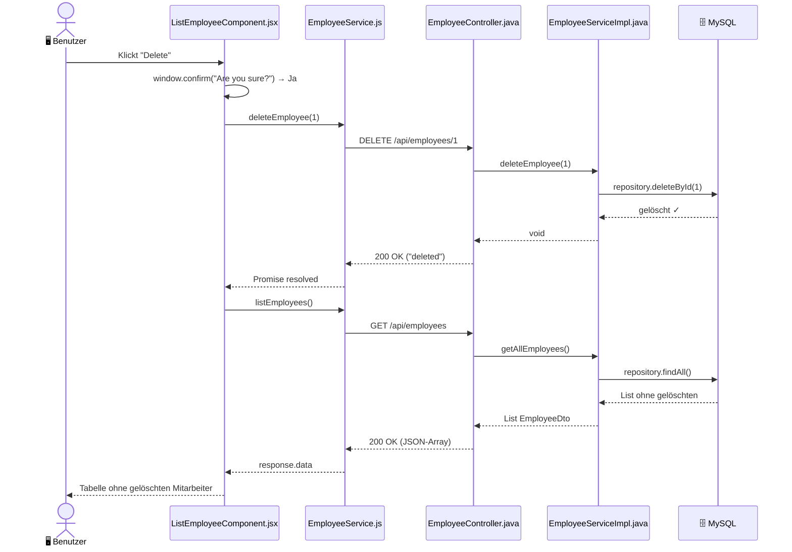

---

### Beispiel E: Mitarbeiter nicht gefunden (`GET /api/employees/999`)

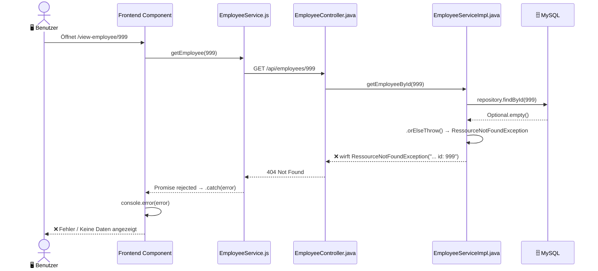

---

## 6. REST-API-Übersicht

| Methode  | Endpunkt              | Request-Body       | Response-Body        | Status-Code   |
| -------- | --------------------- | ------------------ | -------------------- | ------------- |
| `POST`   | `/api/employees`      | `EmployeeDto` JSON | `EmployeeDto` JSON   | `201 Created` |
| `GET`    | `/api/employees`      | —                  | `List<EmployeeDto>`  | `200 OK`      |
| `GET`    | `/api/employees/{id}` | —                  | `EmployeeDto` JSON   | `200 OK`      |
| `PUT`    | `/api/employees/{id}` | `EmployeeDto` JSON | `EmployeeDto` JSON   | `200 OK`      |
| `DELETE` | `/api/employees/{id}` | —                  | `String` (Nachricht) | `200 OK`      |

---

## 7. UML-Diagramme — Anleitung

Es gibt **4 UML-Diagramm-Typen**, die für dieses Projekt relevant sind.

---

### 7.1 Komponenten-Diagramm

**Zweck:** Die 3 Schichten und ihre Kommunikation zeigen.

**Regeln:**

- Jede Schicht = großes Rechteck mit `«component»` oben
- Kommunikation = ausgefüllter Pfeil `──►`
- Protokoll über den Pfeil schreiben: `HTTP/REST`, `JPA/SQL`

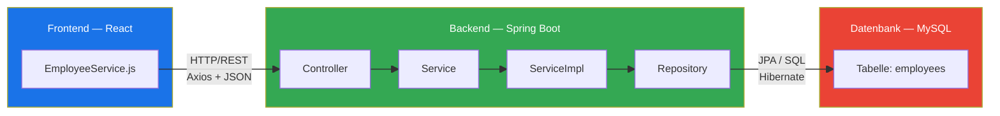

---

### 7.2 Klassen-Diagramm

**Zweck:** Alle Java-Klassen mit Feldern, Methoden und Beziehungen zeigen.

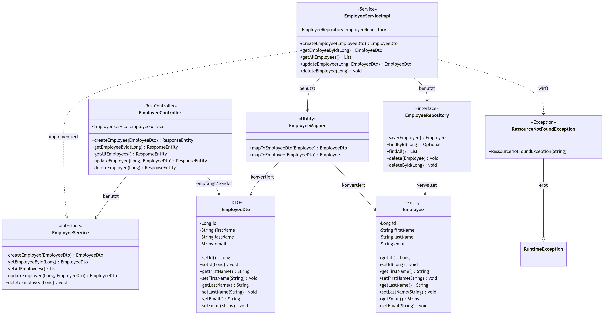

**Beziehungstypen:**

| Symbol    | Name         | Bedeutung                           | Beispiel                                          |
| --------- | ------------ | ----------------------------------- | ------------------------------------------------- |
| `──────►` | Assoziation  | "nutzt dauerhaft"                   | `EmployeeController ──► EmployeeService`          |
| `------►` | Abhängigkeit | "nutzt kurzfristig / kennt den Typ" | `EmployeeMapper ---► Employee`                    |
| `──────▷` | Vererbung    | `extends`                           | `RessourceNotFoundException ──▷ RuntimeException` |
| `------▷` | Realisierung | `implements`                        | `EmployeeServiceImpl ---▷ EmployeeService`        |

**Alle Beziehungen des Projekts:**

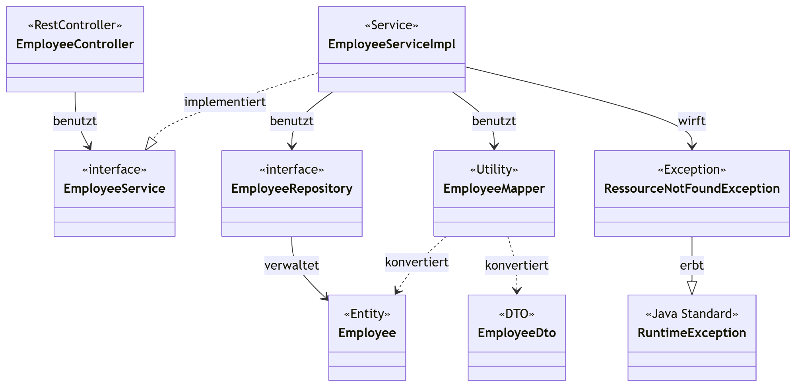

---

### 7.3 ER-Diagramm (Entity-Relationship)

**Zweck:** Die Datenbankstruktur zeigen.

**Regeln:**

- Tabelle = Rechteck mit Tabellenname oben
- Primärschlüssel = unterstrichen oder mit `PK` markiert
- Constraints direkt hinter den Typ schreiben

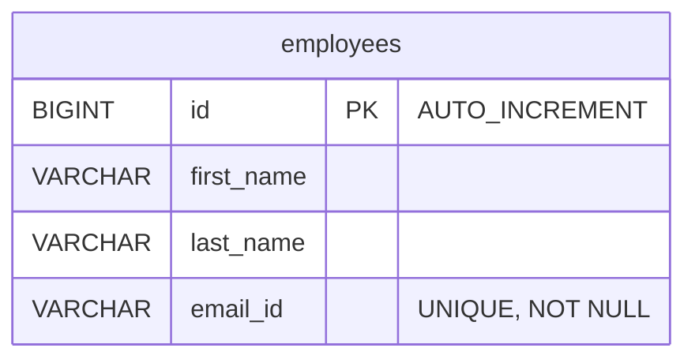

> Da die Anwendung nur eine einzige Tabelle hat, gibt es **keine Fremdschlüssel** und **keine Beziehungslinien** im ER-Diagramm.

---

## 8. Docker und Deployment

### 8.1 Überblick — Container-Architektur

Die Anwendung besteht aus **3 Docker-Containern**, die über Docker Compose orchestriert werden:

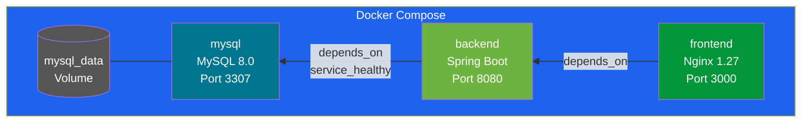

**Start-Reihenfolge (depends_on):**

```
mysql (healthy) ◄── backend (started) ◄── frontend (started)
```

---

### 8.2 `DockerFile.backend` — `employee-management-backend/`

| Eigenschaft     | Wert                                        |
| --------------- | ------------------------------------------- |
| **Basis-Image** | `eclipse-temurin:17-jre-alpine`             |
| **Artefakt**    | `target/*.jar` (nach Maven Build)           |
| **Einstieg**    | `java -jar employee-management-backend.jar` |

```dockerfile
FROM eclipse-temurin:17-jre-alpine
LABEL maintainer="leonel.nguimatsia"
COPY target/employee-management-backend-0.0.1-SNAPSHOT.jar employee-management-backend.jar
ENTRYPOINT ["java", "-jar", "employee-management-backend.jar"]
```

**Was es tut:**

1. Nimmt ein schlankes Alpine-Image mit Java 17 JRE (kein JDK — nur Runtime)
2. Kopiert das fertig kompilierte JAR hinein
3. Startet die Spring-Boot-Anwendung beim Container-Start

> **Voraussetzung:** Das JAR muss **vor** dem Docker-Build existieren → `mvn package` zuerst ausführen.

---

### 8.3 `DockerFile.frontend` — `employee-management-frontend/`

| Eigenschaft       | Wert                                     |
| ----------------- | ---------------------------------------- |
| **Stage 1**       | `node:20-alpine` — Build-Umgebung        |
| **Stage 2**       | `nginx:1.27-alpine` — Produktions-Server |
| **Artefakt**      | `/dist` (Vite Build-Output)              |
| **Interner Port** | `80`                                     |

```dockerfile
# Stage 1: React-App bauen
FROM node:20-alpine AS build
WORKDIR /employee-management-frontend
COPY package*.json ./
RUN apk add --no-cache python3 make g++
RUN npm ci
COPY . .
RUN npm run build

# Stage 2: Statische Dateien mit Nginx ausliefern
FROM nginx:1.27-alpine
COPY nginx.conf /etc/nginx/conf.d/default.conf
COPY --from=build /employee-management-frontend/dist /usr/share/nginx/html
EXPOSE 80
CMD ["nginx", "-g", "daemon off;"]
```

**Was es tut (Multi-Stage Build):**

| Stage   | Was passiert                                                                                                |
| ------- | ----------------------------------------------------------------------------------------------------------- |
| Stage 1 | Node.js installiert Abhängigkeiten und baut die React-App (`npm run build`)                                 |
| Stage 2 | Nur die fertigen statischen Dateien (`/dist`) werden in Nginx kopiert. Node.js kommt nicht ins finale Image |

> **Vorteil Multi-Stage:** Das finale Image enthält **kein Node.js** — deutlich kleiner und sicherer.

---

### 8.4 `docker-compose.yml` — Root-Verzeichnis

```yaml
services:
  mysql:
    image: mysql:8.0
    container_name: mysql
    environment:
      MYSQL_ROOT_PASSWORD: ${DB_MYSQL_PASSWORD} # aus .env-Datei
      MYSQL_DATABASE: ems
    ports:
      - '3307:3306' # Host 3307 → Container 3306
    volumes:
      - mysql_data:/var/lib/mysql # Daten persistent speichern
    healthcheck:
      test: ['CMD', 'mysqladmin', 'ping', '-h', 'localhost']
      interval: 10s
      timeout: 5s
      retries: 5

  backend:
    build:
      context: ./employee-management-backend
      dockerfile: DockerFile.backend
    container_name: employee-management-backend
    ports:
      - '8080:8080'
    depends_on:
      mysql:
        condition: service_healthy # wartet bis MySQL GESUND ist
    environment:
      SPRING_DATASOURCE_URL: jdbc:mysql://mysql:3306/ems
      SPRING_DATASOURCE_USERNAME: root
      SPRING_DATASOURCE_PASSWORD: ${DB_MYSQL_PASSWORD}

  frontend:
    build:
      context: ./employee-management-frontend
      dockerfile: DockerFile.frontend
    container_name: employee-management-frontend
    ports:
      - '3000:80' # Host 3000 → Nginx Container-Port 80
    depends_on:
      - backend

volumes:
  mysql_data:
```

---

### 8.5 Befehle — Anwendung lokal starten

**Voraussetzung:** Docker Desktop muss laufen.

```bash
# Schritt 1: Backend JAR bauen (im backend-Verzeichnis)
cd employee-management-backend
mvn clean package -DskipTests

# Schritt 2: Zurück ins Root-Verzeichnis
cd ..

# Schritt 3: Alle 3 Container bauen und starten
docker compose up --build

# Schritt 4: Anwendung im Browser öffnen
# Frontend:  http://localhost:3000
# Backend:   http://localhost:8080/api/employees
# MySQL:     localhost:3307  (z.B. mit DBeaver oder MySQL Workbench)
```

**Weitere nützliche Befehle:**

| Befehl                           | Aktion                                    |
| -------------------------------- | ----------------------------------------- |
| `docker compose up --build`      | Alles bauen und starten                   |
| `docker compose up -d`           | Im Hintergrund starten (detached)         |
| `docker compose down`            | Alle Container stoppen und entfernen      |
| `docker compose down -v`         | Container + Volumes löschen (Daten weg!)  |
| `docker compose logs -f backend` | Live-Logs des Backend-Containers anzeigen |
| `docker ps`                      | Alle laufenden Container anzeigen         |

---

### 8.6 Deployment — Live-URLs

| Schicht         | Plattform | URL                                                               |
| --------------- | --------- | ----------------------------------------------------------------- |
| **Backend**     | Railway   | `https://springboot-production-77d6.up.railway.app`               |
| **Backend API** | Railway   | `https://springboot-production-77d6.up.railway.app/api/employees` |
| **Frontend**    | Netlify   | `https://mitarbeiter-anwendung-app.up.railway.app/`               |

> Die Backend-URL wird im Frontend in `src/services/EmployeeService.js` als `REST_API_URL` hinterlegt.

---

> **Zusammenfassung:** Das Projekt besteht aus **17 Dateien** in 3 Schichten.
> Die Daten fließen immer in dieser Richtung: `Frontend → Controller → Service → Repository → MySQL`
> — und die Antwort denselben Weg zurück.
> Jede Schicht kennt nur die direkt benachbarte Schicht.
